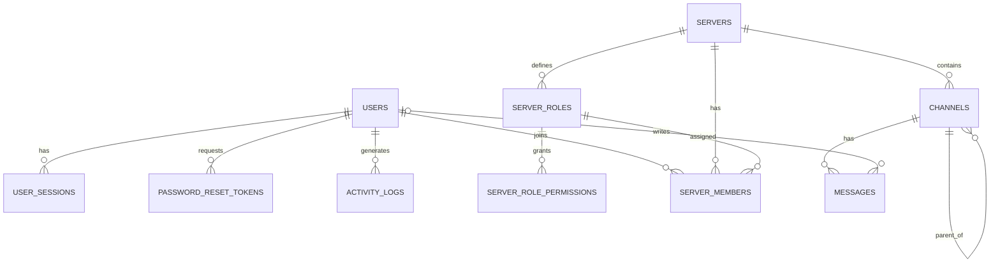

# Relazione di Basi di Dati — Melo Project (v1.0.0)

Data: 20 dicembre 2025  
DBMS: SQLite 3 (file `database/melo_chat.db`)  
Applicazione: chat real-time (testo + voce) stile TeamSpeak/Discord, con ruoli e permessi per stanza.

## 0. Guida rapida (per collaborazione con un’altra AI)
Questo file è pensato per essere completato/raffinato anche da un’altra AI.

### 0.1 Obiettivo
Produrre una relazione universitaria aderente al programma di **Basi di Dati** (modello relazionale, algebra relazionale, SQL, progettazione, normalizzazione, organizzazione fisica, transazioni/concorrenza; cenni a XML/NoSQL), usando come caso di studio il database reale di Melo Project.

### 0.2 Vincoli e assunzioni
- DBMS: **SQLite** (quindi: niente stored procedure “vere”; supporto a VIEW e TRIGGER).
- Lo schema “di verità” è in `database/database.js` (`createSchema()` + indici + migrazioni via `ALTER TABLE`).
- Evitare di inventare tabelle/attributi non presenti: se serve proporre migliorie, inserirle come **“migliorie consigliate”**.

### 0.3 Convenzioni di scrittura
- Ogni sezione deve avere: (1) collegamento al progetto/caso d’uso, (2) formalizzazione “da corso” (definizioni, notazione, motivazioni).
- Quando inserisci esempi SQL/algebra: indicare chiaramente le relazioni coinvolte e i parametri (`?`).
- Se una feature non esiste (es. stored procedure), descrivere l’alternativa (logica applicativa o trigger).

### 0.4 Backlog per un’altra AI (task chiari)
1) Aggiungere 3–5 query “da esame” (JOIN multipli, aggregazioni, HAVING, subquery correlate) e tradurre almeno 3 in algebra relazionale.
2) Formalizzare normalizzazione: indicare DF principali e discutere 3NF/BCNF su 2–3 tabelle.
3) Scrivere 1 trigger di esempio completo (SQL) e motivarlo (audit o updated_at).
4) Aggiungere una mini-sezione su gestione accessi/ruoli (modello ACL) e integrità.

### 0.5 Prompt pronto (da incollare in un’altra AI)
```text
Contesto: sto scrivendo una relazione universitaria di Basi di Dati sul progetto “Melo Project” (chat real-time). Il DBMS è SQLite e lo schema reale è documentato in docs/relazione-basi-di-dati.md (Appendice C). Non devi inventare nuove tabelle: puoi solo proporre “migliorie consigliate”.

Obiettivo: completa e migliora docs/relazione-basi-di-dati.md in modo aderente al programma del corso.

Deliverable richiesti:
1) Aggiungi 5 interrogazioni SQL “da esame” (almeno: 2 con GROUP BY/HAVING, 1 con subquery correlata, 1 con LEFT JOIN, 1 con NOT EXISTS).
2) Per almeno 3 di queste interrogazioni, scrivi anche l’algebra relazionale corrispondente.
3) Rafforza la sezione Normalizzazione: elenca DF principali e discuti 3NF/BCNF per 2 tabelle (scegli tu tra users/server_members/messages/server_roles).
4) Aggiungi 1 TRIGGER completo in SQLite (es. audit su activity_logs o aggiornamento updated_at) con motivazione.

Vincoli di stile:
- Non cambiare lo schema del progetto: se serve, scrivi “miglioria consigliata”.
- Usa esempi realistici e coerenti con le tabelle esistenti.
- Mantieni la struttura e la numerazione già presenti.
```

### 0.6 Prompt per “umanizzare” e rifinire (solo revisione stile)
```text
Ruolo: sei un revisore editoriale. Devi rendere più “umana” e scorrevole la relazione in docs/relazione-basi-di-dati.md, mantenendo un tono accademico e chiaro.

Vincoli NON negoziabili:
1) Non cambiare lo schema del database e non inventare tabelle/attributi.
2) Non cambiare il significato tecnico di SQL, algebra relazionale e vincoli.
3) Puoi solo: riscrivere frasi, migliorare coesione, eliminare ripetizioni, uniformare terminologia e formattazione.
4) Mantieni la numerazione delle sezioni e la struttura complessiva.

Obiettivo:
- Migliorare leggibilità e continuità tra le sezioni (introduci/chiudi i paragrafi).
- Rendere più discorsive le parti troppo “a lista” quando opportuno (senza allungare troppo).
- Uniformare: maiuscole/minuscole, termini (Server/server, Canale/canale), e stile delle note.

Checklist di revisione:
- Ogni sezione inizia con 1–2 frasi che spiegano perché esiste.
- Le note tecniche (es. FK mancante, UNIQUE consigliato) restano ma sono espresse in modo neutro.
- Evita frasi tipo “questa sezione verrà completata” o meta-commenti non necessari.
- Mantieni esempi SQL e formule KaTeX intatti (puoi solo aggiungere 1 riga di spiegazione prima/dopo).

Output richiesto:
- Restituisci il testo finale completo del file (stesso ordine), pronto per consegna.
```

---

## Indice operativo (argomenti trattati nel progetto)
1. Introduzione (contesto)
2. Requisiti (informativi e funzionali)
3. Progettazione concettuale e trasformazione al modello relazionale
4. Dizionario dati e vincoli (PK/FK/UNIQUE)
5. Organizzazione fisica: indici e motivazioni
6. SQL: DDL/DML + interrogazioni significative
7. Algebra relazionale: formalizzazione di interrogazioni
8. Viste e trigger (SQLite)
9. Normalizzazione (DF, 3NF/BCNF)
10. Transazioni e concorrenza (SQLite locking)
11. Cenni: evoluzione schema e miglioramenti consigliati
12. Integrità e controllo accessi (ACL, sessioni, token)
13. Cenni XML/NoSQL (confronto)
Appendici: elenco tabelle, dove sta lo schema, DDL completo

## Mappa “programma del corso” ↔ “Melo Project”
- **Modello relazionale**: tabelle `users`, `servers`, `channels`, `messages`, `server_roles`, `server_members`.
- **Vincoli d’integrità**: PK/UNIQUE, FK con azioni ON DELETE, vincoli logici su token e sessioni.
- **Algebra relazionale**: formalizzazione di cronologia messaggi, membri/ruoli, permessi effettivi.
- **SQL**: DDL (Appendice C), DML applicativo (insert messaggi, clear chat, gestione membership), query con join/aggregazioni.
- **Progettazione**: entità/associazioni, trasformazione E-R → relazionale, relazione M:N risolta con tabella ponte.
- **Normalizzazione**: discussione su chiavi candidate e DF; separazione M:N; note su ridondanze (snapshot autore nei messaggi).
- **Organizzazione fisica**: indici presenti e indici consigliati.
- **Transazioni/concorrenza**: casi multi-statement (creazione server, clear chat + audit).
- **Viste/Trigger**: esempi compatibili con SQLite.
- **Integrità e sicurezza**: vincoli referenziali e univocità, token di sessione e reset password, modello ACL (ruoli/permessi).
- **Cenni XML/NoSQL**: motivare perché qui resta relazionale (persistence e query), e dove avrebbe senso NoSQL (eventi, log, realtime).

## 1. Introduzione (contesto applicativo)
Melo Project è un’applicazione real-time composta da:
- Backend Node.js/Express + Socket.IO
- Frontend React/Vite
- Persistenza dati su SQLite (scelta mirata a semplicità di deploy e performance su Raspberry Pi)

Il database gestisce:
- Identità utenti e autenticazione (utenti, sessioni, reset password)
- Struttura “server/stanza” e canali (testo/voce, gerarchia canali)
- Chat testuale persistente per canale
- Ruoli e permessi per ogni server (ACL semplificata)

## 2. Requisiti (estratto)
### 2.1 Requisiti informativi
- Utente: credenziali, email, display name, avatar, stato
- Sessioni: token, scadenza, dispositivo
- Server: nome, creatore
- Canali: nome, tipo (`text|voice`), parent (sotto‑canali)
- Messaggi: testo, autore (anche anonimo/guest), timestamp
- Ruoli/permessi: ruolo per server, set di permessi, membership utente↔server

### 2.2 Requisiti funzionali (principali)
- Registrazione/login → creazione sessione
- Join canale → caricamento cronologia messaggi
- Invio messaggio → persistenza + broadcast real-time
- Clear chat → cancellazione messaggi (solo con permesso)
- Creazione server → canali di default + ruolo owner assegnato al creatore
- Gestione ruoli → creazione ruolo + permessi + assegnazione a membri
- Reset password → token monouso con scadenza

## 3. Modello relazionale (schema logico)
Lo schema è definito principalmente in `database/database.js` (DDL + indici) ed è usato dal backend in `server.js`.

## 3.1 Progettazione (concettuale → logica)
### Concettuale (E-R)
Le entità individuate dai requisiti sono: **Utente**, **Server/Stanza**, **Canale**, **Messaggio**, **Ruolo**, **Permesso**, **Membership** (associazione Utente–Server). Sono presenti anche entità “di supporto” per sicurezza/audit: **Sessione** e **Token reset password**.

Cardinalità principali:
- Un **Server** contiene molti **Canali** (1:N)
- Un **Canale** contiene molti **Messaggi** (1:N)
- Un **Utente** può essere membro di molti **Server** e un **Server** ha molti **Utenti** ⇒ M:N risolta con **server_members**
- Un **Server** definisce molti **Ruoli** (1:N)
- Un **Ruolo** ha molti **Permessi** ⇒ 1:N su **server_role_permissions** (concettualmente un set)

### Logica (relazionale)
La trasformazione a schema relazionale segue le regole standard:
- Entità → tabelle con chiave primaria (es. `users`, `servers`, `channels`)
- Relazioni 1:N → FK nel lato N (es. `channels.server_id`)
- Relazioni M:N → tabella ponte con chiave composta (qui implementata come UNIQUE su `(server_id, user_id)` in `server_members`)

## 3.2 Entità e relazioni (ER “testuale”)
Di seguito una rappresentazione ER (semplificata) coerente con lo schema.



Nota: `MESSAGES.server_id` è presente nello schema ma non è vincolato con FK a `SERVERS(id)` (manca la foreign key). È comunque usato applicativamente per filtrare.

## 4. Dizionario dei dati (tabelle, chiavi, vincoli)

### 4.1 `users`
- **PK**: `id` (INTEGER AUTOINCREMENT)
- **UNIQUE**: `username`, `email`
- Campi chiave:
  - `password_hash` (hash bcrypt)
  - `display_name`, `avatar`, `bio`
  - `is_admin`, `global_role`, `server_quota`
  - `created_at`, `updated_at`, `last_login`

### 4.2 `user_sessions`
- **PK**: `id`
- **FK**: `user_id → users(id)` ON DELETE CASCADE
- **UNIQUE**: `token`
- Vincoli logici:
  - `expires_at` determina validità sessione

### 4.3 `password_reset_tokens`
- **PK**: `id`
- **FK**: `user_id → users(id)` ON DELETE CASCADE
- **UNIQUE**: `token_hash`
- Campi:
  - `expires_at`, `consumed_at` (token monouso)

### 4.4 `servers`
- **PK**: `id` (TEXT, es. `server:<uuid>`)
- Campo:
  - `created_by` (aggiunto via `ALTER TABLE`, FK logica verso `users(id)` con ON DELETE SET NULL)

### 4.5 `channels`
- **PK**: `id` (TEXT, es. `channel:<serverId>:general`)
- **FK**: `server_id → servers(id)` ON DELETE CASCADE
- Campo:
  - `parent_id → channels(id)` ON DELETE CASCADE (gerarchia)
  - `type` DEFAULT `'text'` (testo/voce)

### 4.6 `messages`
- **PK**: `id` (INTEGER AUTOINCREMENT)
- **FK**: `channel_id → channels(id)` ON DELETE CASCADE
- **FK**: `user_id → users(id)` ON DELETE SET NULL (messaggi persistono anche se utente viene eliminato)
- Campi:
  - `server_id` (ridondanza applicativa per filtrare; vedi nota FK mancante)
  - `username`, `display_name` (snapshot dell’autore al momento dell’invio)
  - `text`, `created_at`

### 4.7 `server_roles`
- **PK**: `id` (TEXT, es. `role:<serverId>:owner`)
- **FK**: `server_id → servers(id)` ON DELETE CASCADE
- **FK**: `created_by → users(id)` ON DELETE SET NULL
- Indici unici:
  - `(server_id, name)`
  - `(server_id, key)` dove `key IS NOT NULL`

### 4.8 `server_role_permissions`
- **PK**: `id`
- **FK**: `role_id → server_roles(id)` ON DELETE CASCADE
- Campi:
  - `permission` (string), `value` (0/1)
- Nota: manca un vincolo UNIQUE su `(role_id, permission)`; la logica usa `INSERT OR IGNORE` ma senza UNIQUE l’IGNORE non impedisce duplicati.

### 4.9 `server_members`
- **PK**: `id`
- **FK**: `server_id → servers(id)` ON DELETE CASCADE
- **FK**: `user_id → users(id)` ON DELETE CASCADE
- **FK**: `role_id → server_roles(id)` ON DELETE RESTRICT
- **UNIQUE**: `(server_id, user_id)` (un utente compare una sola volta per server)

## 5. Indici e motivazioni (organizzazione fisica)
Indici implementati (estratto):
- `idx_server_members_server_user` su `(server_id, user_id)` → join membership/permessi
- `idx_server_roles_server_name`, `idx_server_roles_server_key` → lookup ruoli
- `idx_password_reset_tokens_hash` → verifica token reset

Indici consigliati per query frequenti (non ancora presenti):
- `messages(channel_id, created_at)` → cronologia per canale
- `channels(server_id, created_at)` → list canali per server

## 6. SQL — DDL / DML / Interrogazioni
Il DDL completo (CREATE TABLE/INDEX e migrazioni `ALTER TABLE`) è riportato in **Appendice C**.

Esempi reali dal backend:
- Cronologia canale:
  - `SELECT id, username, display_name, text, created_at FROM messages WHERE server_id=? AND channel_id=? ORDER BY created_at ASC LIMIT ?`
- Inserimento messaggio:
  - `INSERT INTO messages (server_id, channel_id, user_id, username, display_name, text, created_at) VALUES (...)`
- Clear chat:
  - `DELETE FROM messages WHERE server_id=? AND channel_id=?`

### 6.1 Interrogazioni “da relazione” (set minimo)
Di seguito un set iniziale di interrogazioni utili per coprire SELECT/JOIN/GROUP BY/SUBQUERY.

1) **Elenco server con numero canali**
```sql
SELECT s.id, s.name, COUNT(c.id) AS channel_count
FROM servers s
LEFT JOIN channels c ON c.server_id = s.id
GROUP BY s.id, s.name
ORDER BY channel_count DESC, s.name ASC;
```

2) **Ultimi N messaggi di un canale**
```sql
SELECT m.id, m.channel_id, m.username, m.display_name, m.text, m.created_at
FROM messages m
WHERE m.server_id = ? AND m.channel_id = ?
ORDER BY m.created_at DESC
LIMIT ?;
```

3) **Membri di un server con ruolo e priorità (JOIN)**
```sql
SELECT sm.user_id, u.username, COALESCE(u.display_name, u.username) AS display_name,
       sr.id AS role_id, sr.name AS role_name, sr.priority
FROM server_members sm
JOIN users u ON u.id = sm.user_id
JOIN server_roles sr ON sr.id = sm.role_id
WHERE sm.server_id = ? AND sm.status = 'active'
ORDER BY sr.priority ASC, display_name ASC;
```

4) **Permessi effettivi di un utente in un server (JOIN + filtro)**
```sql
SELECT srp.permission
FROM server_members sm
JOIN server_role_permissions srp ON srp.role_id = sm.role_id
WHERE sm.server_id = ? AND sm.user_id = ? AND srp.value <> 0
ORDER BY srp.permission ASC;
```

5) **Server creati da un utente (subquery o join)**
```sql
SELECT s.id, s.name, s.created_at
FROM servers s
WHERE s.created_by = (
  SELECT u.id FROM users u WHERE u.username = ?
)
ORDER BY s.created_at DESC;
```

### 6.2 Interrogazioni “da esame” (set richiesto)
Le seguenti 5 interrogazioni sono scelte per coprire esplicitamente i costrutti tipici d’esame: **GROUP BY/HAVING**, **subquery correlata**, **LEFT JOIN**, **NOT EXISTS**.

1) **Canali più attivi (GROUP BY + HAVING)**
Obiettivo: contare i messaggi per canale in un server e selezionare solo i canali con almeno $k$ messaggi.
```sql
SELECT c.id, c.name, COUNT(m.id) AS msg_count
FROM channels c
JOIN messages m ON m.channel_id = c.id
WHERE c.server_id = ?
GROUP BY c.id, c.name
HAVING COUNT(m.id) >= ?
ORDER BY msg_count DESC, c.name ASC;
```

2) **Utenti più attivi nel server (GROUP BY + HAVING)**
Nota: qui contiamo solo messaggi con `user_id` valorizzato (utenti registrati).
```sql
SELECT u.id, u.username, COUNT(m.id) AS msg_count
FROM users u
JOIN messages m ON m.user_id = u.id
WHERE m.server_id = ?
GROUP BY u.id, u.username
HAVING COUNT(m.id) >= ?
ORDER BY msg_count DESC, u.username ASC;
```

3) **Ultimo messaggio per ciascun utente (subquery correlata)**
```sql
SELECT u.id, u.username,
       (
         SELECT MAX(m.created_at)
         FROM messages m
         WHERE m.server_id = ? AND m.user_id = u.id
       ) AS last_message_at
FROM users u
WHERE EXISTS (
  SELECT 1 FROM messages m2 WHERE m2.server_id = ? AND m2.user_id = u.id
)
ORDER BY last_message_at DESC;
```

4) **Numero membri per ruolo (LEFT JOIN)**
Obiettivo: includere anche ruoli senza membri (conteggio 0).
```sql
SELECT r.id, r.name, COUNT(sm.id) AS member_count
FROM server_roles r
LEFT JOIN server_members sm
  ON sm.role_id = r.id AND sm.server_id = r.server_id
WHERE r.server_id = ?
GROUP BY r.id, r.name
ORDER BY r.priority ASC, r.name ASC;
```

5) **Utenti NON membri di un server (NOT EXISTS)**
```sql
SELECT u.id, u.username
FROM users u
WHERE NOT EXISTS (
  SELECT 1
  FROM server_members sm
  WHERE sm.server_id = ? AND sm.user_id = u.id
)
ORDER BY u.username ASC;
```

## 7. Algebra relazionale (esempi)
Qui formalizziamo 2–3 interrogazioni chiave.

### 7.1 Cronologia messaggi di un canale
Sia `MESSAGES(m)` e `USERS(u)`.
- Se consideriamo solo messaggi con autore registrato:

$$\pi_{m.id, m.text, m.created\_at, u.username, u.display\_name}(\sigma_{m.channel\_id = cid}(MESSAGES\ m) \bowtie_{m.user\_id = u.id} USERS\ u)$$

- Nota: nel sistema reale alcuni messaggi possono avere `user_id` NULL (guest/snapshot). In SQL si usa spesso una LEFT JOIN o si usa `username/display_name` già presenti in `messages`.

### 7.2 Membri di un server con ruolo
$$\pi_{sm.user\_id, sr.name}(\sigma_{sm.server\_id = sid}(SERVER\_MEMBERS\ sm) \bowtie_{sm.role\_id = sr.id} SERVER\_ROLES\ sr)$$

### 7.3 Utenti non membri di un server (NOT EXISTS / differenza)
Sia `USERS(u)` e `SERVER_MEMBERS(sm)`.

Definiamo l’insieme dei membri del server $sid$:
$$M = \pi_{u.id, u.username}(USERS\ u \bowtie_{u.id = sm.user\_id} \sigma_{sm.server\_id = sid}(SERVER\_MEMBERS\ sm))$$

Allora l’insieme degli utenti *non* membri è:
$$\pi_{id, username}(USERS) - M$$

### 7.4 Ultimo messaggio per utente (MAX) — algebra estesa con raggruppamento
Per esprimere `MAX(created_at)` usiamo l’operatore di raggruppamento/aggregazione (algebra relazionale estesa):
$$L = \gamma_{user\_id;\ \max(created\_at) \rightarrow last\_message\_at}(\sigma_{server\_id = sid}(MESSAGES))$$
Risultato (con join a `USERS` per recuperare `username`):
$$\pi_{u.id, u.username, L.last\_message\_at}(USERS\ u \bowtie_{u.id = L.user\_id} L)$$

### 7.5 Membri per ruolo (LEFT JOIN) — nota su join esterno
Il `LEFT JOIN` non appartiene all’algebra relazionale “di base”; in algebra estesa si usa il **join esterno sinistro** $\leftouterjoin$.

Sia:
$$C = \gamma_{role\_id;\ \count(id) \rightarrow member\_count}(\sigma_{server\_id = sid}(SERVER\_MEMBERS))$$
Allora (ruoli del server con conteggio, includendo 0):
$$\pi_{r.id, r.name, C.member\_count}(\sigma_{r.server\_id = sid}(SERVER\_ROLES\ r) \ \leftouterjoin_{r.id = C.role\_id} \ C)$$

## 8. Viste e Trigger
SQLite supporta **VIEW** e **TRIGGER**. Nel progetto attuale la logica applicativa gestisce molte regole.

Per la relazione (in linea con il programma del corso) si possono documentare/aggiungere:
- **Vista** `v_channel_messages` che unisce messaggi e utenti (quando `user_id` non è NULL)
- **Trigger** per aggiornare `users.updated_at` su modifica profilo
- **Trigger** per scrivere `activity_logs` su eventi rilevanti (login, logout, create server, clear chat)

Esempio (vista):
```sql
CREATE VIEW IF NOT EXISTS v_channel_messages AS
SELECT m.id, m.server_id, m.channel_id, m.text, m.created_at,
       m.user_id,
       COALESCE(u.username, m.username) AS username,
       COALESCE(u.display_name, m.display_name, m.username) AS display_name
FROM messages m
LEFT JOIN users u ON u.id = m.user_id;
```

Esempio (trigger): aggiornamento automatico di `users.updated_at`.

Motivazione: il campo `updated_at` esiste nello schema ma, senza trigger, richiede che ogni update applicativo lo aggiorni esplicitamente. Il trigger centralizza la regola nel DB.
```sql
CREATE TRIGGER IF NOT EXISTS trg_users_updated_at
AFTER UPDATE ON users
FOR EACH ROW
WHEN NEW.updated_at = OLD.updated_at
BEGIN
  UPDATE users
  SET updated_at = CURRENT_TIMESTAMP
  WHERE id = OLD.id;
END;
```

Esempio (trigger): audit su cambio stato utente (scrittura in `activity_logs`).

Motivazione: mostrare un caso tipico di trigger “da corso” per auditing, senza dipendere dalla logica applicativa.
```sql
CREATE TRIGGER IF NOT EXISTS trg_users_status_audit
AFTER UPDATE OF status ON users
FOR EACH ROW
WHEN NEW.status <> OLD.status
BEGIN
  INSERT INTO activity_logs (user_id, action, details, ip_address)
  VALUES (
    NEW.id,
    'status_change',
    'status: ' || OLD.status || ' -> ' || NEW.status,
    NULL
  );
END;
```

## 9. Normalizzazione (traccia)
- **Chiavi candidate**:
  - `users`: chiavi candidate `id`, `username`, `email` (le ultime due sono UNIQUE)
  - `server_members`: chiavi candidate `id` e, logicamente, la coppia `(server_id, user_id)` (UNIQUE)

- **Dipendenze funzionali (DF) — esempi utili in relazione**:
  - In `users`: `id → username, email, password_hash, display_name, avatar, bio, status, created_at, updated_at, last_login, ...`
  - In `users`: `username → id, email, ...` e `email → id, username, ...` (assumendo UNIQUE)
  - In `server_members`: `(server_id, user_id) → role_id, status, nickname, invited_by, joined_at`

### 9.1 Discussione 3NF/BCNF (2 tabelle)
**Tabella `users`**
- Con chiavi candidate `id`, `username`, `email`, ogni DF non banale ha come determinante una superchiave (es. `username` è superchiave perché UNIQUE).
- Quindi `users` è in **BCNF** (e di conseguenza anche in 3NF).

**Tabella `server_members`**
- L’associazione M:N è correttamente risolta con tabella ponte e vincolo UNIQUE su `(server_id, user_id)`.
- Le DF rilevanti hanno determinante una superchiave (`id` oppure `(server_id, user_id)`), quindi la tabella è in **BCNF**.

Nota progettuale (denormalizzazione controllata): in `messages` sono salvati anche `username`/`display_name` come “snapshot” per preservare il contenuto storico e ridurre join frequenti. Questo è un compromesso tra normalizzazione e requisiti applicativi.

- Miglioria consigliata (per coerenza): aggiungere UNIQUE `(role_id, permission)` su `server_role_permissions`.

## 10. Transazioni e concorrenza
- SQLite usa locking a livello file; le operazioni multi‑statement importanti dovrebbero essere eseguite in transazione (`BEGIN … COMMIT`) per atomicità.
- Casi tipici: creazione server (server + canali + membership + ruoli), clear chat con logging.

## 11. Evoluzione schema e miglioramenti consigliati
Questa sezione serve a mostrare “ragionamento da corso” senza cambiare il progetto.

Migliorie consigliate (non obbligatorie):
- Aggiungere vincolo UNIQUE su `(role_id, permission)` in `server_role_permissions` per evitare duplicati.
- Valutare FK su `messages.server_id → servers(id)` (coerenza referenziale). Attualmente il filtro per server è gestito applicativamente.
- Aggiungere indici su `messages(channel_id, created_at)` per ottimizzare la cronologia.

## 12. Integrità e controllo accessi (ACL, sessioni, token)
Questa sezione collega i concetti “da corso” (integrità e controllo degli accessi) con il caso d’uso reale.

### 12.1 Integrità referenziale e vincoli
- **Integrità di entità**: PK su tutte le tabelle; UNIQUE su `users.username`, `users.email`.
- **Integrità referenziale (FK)**: esempi importanti:
  - `user_sessions.user_id → users(id)` con ON DELETE CASCADE (sessioni eliminate con l’utente)
  - `channels.server_id → servers(id)` con ON DELETE CASCADE (canali eliminati col server)
  - `messages.channel_id → channels(id)` con ON DELETE CASCADE (messaggi eliminati col canale)
  - `messages.user_id → users(id)` con ON DELETE SET NULL (storicizzazione messaggi anche se l’utente viene eliminato)

### 12.2 Controllo accessi (ACL semplificata)
Il progetto implementa un modello a **ruoli e permessi** per server:
- `server_roles` definisce i ruoli (owner/default, priorità)
- `server_role_permissions` definisce il set di permessi per ruolo
- `server_members` assegna un ruolo a ciascun utente membro di un server

La verifica dei permessi avviene tipicamente via join (esempio in sezione 6.1/6.2). Questo collega i concetti di autorizzazione alle interrogazioni SQL.

### 12.3 Sessioni e reset password (sicurezza applicativa)
- Sessioni: `user_sessions.token` è UNIQUE e ha `expires_at`.
- Reset password: `password_reset_tokens.token_hash` è UNIQUE, con `expires_at` e `consumed_at` (token monouso).

Nota: SQLite non fornisce ruoli/privilegi come DBMS enterprise; la “sicurezza” è in gran parte applicativa, ma i vincoli (UNIQUE/FK) e i trigger aiutano a mantenere coerenza e audit.

## 13. Cenni XML/NoSQL (confronto)
Questa sezione è un **cenno** (come spesso richiesto dal programma) per motivare la scelta del modello e discutere alternative.

### 13.1 Perché relazionale qui
- Il dominio ha entità e relazioni ben definite (Utente–Server–Canale–Messaggio) e interrogazioni tipiche con join/aggregazioni.
- I vincoli (FK/UNIQUE) aiutano a mantenere coerenza dei dati in modo dichiarativo.
- SQLite è adatto a deploy “edge” (es. Raspberry Pi): file unico, setup semplice, buone prestazioni per carichi moderati.

### 13.2 Dove avrebbe senso NoSQL (senza cambiare il progetto)
- **Eventi e telemetria** (log ad alto volume): un document store o time-series DB può semplificare ingestion e retention.
- **Cache di presenza** (online/offline, canali vocali): in-memory key-value (es. Redis) per stato volatile e aggiornamenti rapidi.

### 13.3 Cenno su XML
In questo progetto non c’è una necessità naturale di rappresentazione XML; se richiesto, si può motivare che scambi dati avvengono via JSON (API) e che XML sarebbe più tipico per integrazioni legacy o documenti strutturati.

---

## Appendice A — Elenco tabelle
`users`, `user_sessions`, `activity_logs`, `servers`, `channels`, `messages`, `server_roles`, `server_role_permissions`, `server_members`, `password_reset_tokens`

## Appendice B — Dove si trova lo schema nel progetto
- DDL/Schema: `database/database.js` (`createSchema()`)
- Query principali lato backend: `server.js` (Socket.IO handlers)

## Appendice C — DDL completo (schema + indici + migrazioni)
Di seguito l’estratto aderente al codice sorgente (SQLite). Nota: nel progetto le `ALTER TABLE` vengono eseguite solo se la colonna non esiste (helper `addColumnIfMissing`).

```sql
CREATE TABLE IF NOT EXISTS users (
  id INTEGER PRIMARY KEY AUTOINCREMENT,
  username TEXT UNIQUE NOT NULL,
  email TEXT UNIQUE NOT NULL,
  password_hash TEXT NOT NULL,
  display_name TEXT,
  avatar TEXT,
  bio TEXT DEFAULT '',
  is_admin INTEGER DEFAULT 0,
  is_verified INTEGER DEFAULT 0,
  status TEXT DEFAULT 'offline',
  created_at DATETIME DEFAULT CURRENT_TIMESTAMP,
  updated_at DATETIME DEFAULT CURRENT_TIMESTAMP,
  last_login DATETIME
);

CREATE TABLE IF NOT EXISTS user_sessions (
  id INTEGER PRIMARY KEY AUTOINCREMENT,
  user_id INTEGER NOT NULL,
  token TEXT UNIQUE NOT NULL,
  device_info TEXT,
  ip_address TEXT,
  last_activity DATETIME DEFAULT CURRENT_TIMESTAMP,
  expires_at DATETIME NOT NULL,
  created_at DATETIME DEFAULT CURRENT_TIMESTAMP,
  FOREIGN KEY (user_id) REFERENCES users(id) ON DELETE CASCADE
);

CREATE TABLE IF NOT EXISTS activity_logs (
  id INTEGER PRIMARY KEY AUTOINCREMENT,
  user_id INTEGER,
  action TEXT NOT NULL,
  details TEXT,
  ip_address TEXT,
  created_at DATETIME DEFAULT CURRENT_TIMESTAMP,
  FOREIGN KEY (user_id) REFERENCES users(id) ON DELETE SET NULL
);

CREATE TABLE IF NOT EXISTS servers (
  id TEXT PRIMARY KEY,
  name TEXT NOT NULL,
  created_at DATETIME DEFAULT CURRENT_TIMESTAMP
);

CREATE TABLE IF NOT EXISTS channels (
  id TEXT PRIMARY KEY,
  server_id TEXT NOT NULL,
  name TEXT NOT NULL,
  created_at DATETIME DEFAULT CURRENT_TIMESTAMP,
  FOREIGN KEY (server_id) REFERENCES servers(id) ON DELETE CASCADE
);

CREATE TABLE IF NOT EXISTS messages (
  id INTEGER PRIMARY KEY AUTOINCREMENT,
  server_id TEXT NOT NULL,
  channel_id TEXT NOT NULL,
  user_id INTEGER,
  username TEXT NOT NULL,
  display_name TEXT,
  text TEXT NOT NULL,
  created_at DATETIME DEFAULT CURRENT_TIMESTAMP,
  FOREIGN KEY (user_id) REFERENCES users(id) ON DELETE SET NULL,
  FOREIGN KEY (channel_id) REFERENCES channels(id) ON DELETE CASCADE
);

CREATE TABLE IF NOT EXISTS server_roles (
  id TEXT PRIMARY KEY,
  server_id TEXT NOT NULL,
  name TEXT NOT NULL,
  key TEXT,
  description TEXT DEFAULT '',
  is_owner INTEGER DEFAULT 0,
  is_default INTEGER DEFAULT 0,
  priority INTEGER DEFAULT 100,
  created_by INTEGER,
  created_at DATETIME DEFAULT CURRENT_TIMESTAMP,
  FOREIGN KEY (server_id) REFERENCES servers(id) ON DELETE CASCADE,
  FOREIGN KEY (created_by) REFERENCES users(id) ON DELETE SET NULL
);

CREATE TABLE IF NOT EXISTS server_role_permissions (
  id INTEGER PRIMARY KEY AUTOINCREMENT,
  role_id TEXT NOT NULL,
  permission TEXT NOT NULL,
  value INTEGER DEFAULT 1,
  created_at DATETIME DEFAULT CURRENT_TIMESTAMP,
  FOREIGN KEY (role_id) REFERENCES server_roles(id) ON DELETE CASCADE
);

CREATE TABLE IF NOT EXISTS server_members (
  id INTEGER PRIMARY KEY AUTOINCREMENT,
  server_id TEXT NOT NULL,
  user_id INTEGER NOT NULL,
  role_id TEXT NOT NULL,
  nickname TEXT,
  status TEXT DEFAULT 'active',
  invited_by INTEGER,
  joined_at DATETIME DEFAULT CURRENT_TIMESTAMP,
  FOREIGN KEY (server_id) REFERENCES servers(id) ON DELETE CASCADE,
  FOREIGN KEY (user_id) REFERENCES users(id) ON DELETE CASCADE,
  FOREIGN KEY (role_id) REFERENCES server_roles(id) ON DELETE RESTRICT,
  FOREIGN KEY (invited_by) REFERENCES users(id) ON DELETE SET NULL
);

CREATE TABLE IF NOT EXISTS password_reset_tokens (
  id INTEGER PRIMARY KEY AUTOINCREMENT,
  user_id INTEGER NOT NULL,
  token_hash TEXT NOT NULL,
  expires_at DATETIME NOT NULL,
  consumed_at DATETIME,
  created_at DATETIME DEFAULT CURRENT_TIMESTAMP,
  FOREIGN KEY (user_id) REFERENCES users(id) ON DELETE CASCADE
);

CREATE UNIQUE INDEX IF NOT EXISTS idx_server_roles_server_name
  ON server_roles(server_id, name);

CREATE UNIQUE INDEX IF NOT EXISTS idx_server_roles_server_key
  ON server_roles(server_id, key)
  WHERE key IS NOT NULL;

CREATE UNIQUE INDEX IF NOT EXISTS idx_server_members_server_user
  ON server_members(server_id, user_id);

CREATE INDEX IF NOT EXISTS idx_server_members_role
  ON server_members(role_id);

CREATE INDEX IF NOT EXISTS idx_role_permissions_role
  ON server_role_permissions(role_id);

CREATE UNIQUE INDEX IF NOT EXISTS idx_password_reset_tokens_hash
  ON password_reset_tokens(token_hash);

CREATE INDEX IF NOT EXISTS idx_password_reset_tokens_user
  ON password_reset_tokens(user_id);

-- Migrazioni (aggiunte colonnari condizionali):
ALTER TABLE users ADD COLUMN global_role TEXT DEFAULT 'creator';
ALTER TABLE users ADD COLUMN server_quota INTEGER DEFAULT 5;
ALTER TABLE servers ADD COLUMN created_by INTEGER REFERENCES users(id) ON DELETE SET NULL;
ALTER TABLE channels ADD COLUMN parent_id TEXT REFERENCES channels(id) ON DELETE CASCADE;
ALTER TABLE channels ADD COLUMN type TEXT DEFAULT 'text';
```
